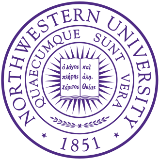








## Welcome! I'm **_Haosen_**.

<!--
I am a Master's student in [Computer Science](https://www.mccormick.northwestern.edu/computer-science/) at [Northwestern University](https://www.mccormick.northwestern.edu/), advised by [Prof. Manling Li](https://limanling.github.io/) at the [MLL Group](https://mll-lab-nu.github.io/) in collaboration with the [Stanford Vision and Learning Lab](https://svl.stanford.edu/). Previously, I was a research intern at the [Shanghai AI Lab](https://www.shlab.org.cn/). I received my Bachelor's degree in [Data Science and Technology](https://dsct.hkust.edu.hk/) from the [Hong Kong University of Science and Technology](https://hkust.edu.hk/), where I was advised by [Prof. Chi-Keung Tang](https://cse.hkust.edu.hk/~cktang/bio.html) and [Prof. Yu-Wing Tai](https://yuwingtai.github.io/). 
-->

I am an incoming Ph.D. student in [Computer and Information Science](https://www.cis.upenn.edu/) at [University of Pennsylvania](https://www.upenn.edu/), affiliated with the [GRASP Lab](https://www.grasp.upenn.edu/) and [IDEAS Center](https://ideas.seas.upenn.edu/), advised by [Prof. René Vidal](https://www.grasp.upenn.edu/people/rene-vidal/). Previously, I was a Master's student at [Northwestern University](https://www.mccormick.northwestern.edu/), advised by [Prof. Manling Li](https://limanling.github.io/) at the [MLL Group](https://mll-lab-nu.github.io/) in collaboration with the [Stanford Vision and Learning Lab](https://svl.stanford.edu/), and a research intern at the [Shanghai AI Lab](https://www.shlab.org.cn/). I received my BSc in [Data Science and Technology](https://dsct.hkust.edu.hk/) from [Hong Kong University of Science and Technology](https://hkust.edu.hk/), advised by [Prof. Chi-Keung Tang](https://cse.hkust.edu.hk/admin/people/faculty/profile/cktang) and [Prof. Yu-Wing Tai](https://yuwingtai.github.io/). 

<!--
I also collaborated with [Prof. Xiaomeng Li](https://xmengli.github.io/) on Medical Vision-Language Models (VLMs) as part of the UROP program.
-->

My research interest spans **vision**, **language**, and **robotics**, with a focus on **Foundation Models**, **Multimodal Reasoning**, and **Generative World Modeling**. I aim to build **efficient**, **controllable**, and **interpretable** models that can <em>reason about</em> and <em>interact with</em> the physical world.

<!-- 注释掉了
I have published more than 100 papers at the top international AI conferences with total <a href='https://scholar.google.com/citations?user=DhtAFkwAAAAJ'>google scholar citations <strong>260000+</strong></a> (You can also use google scholar badge ).
-->

# 🔥 News
<ul style="list-style-type: disc; margin-left: 20px; line-height: 1.4; margin-bottom: 0;">
<li style="margin-bottom: 4px;"><em>2026.04</em>: One paper accepted by <strong>ACL 2026</strong> (Main)!</li>
<li style="margin-bottom: 4px;"><em>2026.01</em>: One paper accepted by <strong>ICLR 2026</strong>!</li>
<li style="margin-bottom: 4px;"><em>2026.01</em>: New work coming to <em>arXiv</em>: <a href="https://arxiv.org/pdf/2601.15224">ProgressLM: towards progress reasoning in Vision-Language Models</a>.</li>

<li style="margin-bottom: 4px;"><em>2025.11</em>: One paper accepted by <strong>AAAI 2026</strong>!</li>
<li style="margin-bottom: 4px;"><em>2025.09</em>: New work coming to <em>arXiv</em>: <a href="https://arxiv.org/pdf/2602.17560">ODESteer: A Unified ODE-based Steering Framework for LLM Alignment</a>.</li>
<li style="margin-bottom: 4px;"><em>2025.02</em>: One paper accepted by <strong>CVPR 2025</strong>!</li>
<li style="margin-bottom: 4px;"><em>2024.07</em>: Will join <a href="https://www.shlab.org.cn/">Shanghai Artificial Intelligence Laboratory</a> as a research intern.</li>
<li style="margin-bottom: 4px;"><em>2024.07</em>: Two papers accepted by <strong>ECCV 2024</strong>!</li>
<li style="margin-bottom: 4px;"><em>2024.06</em>: Awarded <em>"Kaggle Competitions Expert"</em>.</li>
<li style="margin-bottom: 4px;"><em>2024.06</em>: Honored the Dean List Award in <em>Spring 2023-24</em>.</li>
<li style="margin-bottom: 4px;"><em>2024.06</em>: Received a <a href="https://drive.google.com/file/d/1Hrlh49hSojx8Ri6tRwef9uq5Tv_5OW8i/view?usp=sharing">Silver medal</a> 🥈 in <a href="https://www.kaggle.com/competitions/image-matching-challenge-2024"><em>"Image Matching Challenge 2024 - Hexathlon"</em></a> (CVPR'24 Workshop). <a href="https://github.com/HaosenSUN/IMC-2024">Our solution</a> was released.</li>
<li style="margin-bottom: 4px;"><em>2023.11</em>: Received a <a href="https://drive.google.com/file/d/19Z22-iGbAlimB5nizjaBJvcMf9VYsrUo/view?usp=sharing">Silver medal</a> 🥈 in <a href="https://www.kaggle.com/competitions/predict-ai-model-runtime"><em>"Google - Fast or Slow? Predict AI Model Runtime"</em></a>. <a href="https://github.com/HaosenSUN/Google-Competition">Our solution</a> was released.</li>

</ul>

<button id="toggle-news-btn" onclick="toggleNews2024()" style="background-color: #011F5B; color: white; border: none; padding: 6px 12px; border-radius: 3px; cursor: pointer; font-size: 13px; margin-top: 8px; margin-bottom: 8px;">
  Show more
</button>

# 📝 Publications
_*Equal contribution. †Corresponding author/Co-advisor. ‡Project leader._

  <button id="show-selected-btn" onclick="showSelectedPubs()" style="background-color: #011F5B; color: white; border: none; padding: 6px 12px; border-radius: 3px; cursor: pointer; font-size: 13px; margin-right: 8px;">
    Show Selected
  </button>
  <button id="show-all-btn" onclick="showAllPubs()" style="background-color: #d3d3d3; color: #333; border: none; padding: 6px 12px; border-radius: 3px; cursor: pointer; font-size: 13px;">
    Show All
  </button>

<!-- ODESteer -->

ICLR 2026

[ODESteer: A Unified ODE-Based Steering Framework for LLM Alignment](https://arxiv.org/pdf/2602.17560)

**Haosen Sun\***, Hongjue Zhao\*, Jiangtao Kong, Xiaochang Li, Qineng Wang, Liwei Jiang, Qi Zhu, Tarek F. Abdelzaher, Yejin Choi, Manling Li†, Huajie Shao†

_International Conference on Learning Representations (ICLR)_, 2026

[**[Project Page]**](https://odesteer.github.io/) [**[Paper]**](https://arxiv.org/pdf/2602.17560) [**[Code]**](https://github.com/ZhaoHongjue/odesteer) <strong></strong>
- A unified <strong>ODE-based</strong> framework for <strong>multi-step</strong> and <strong>adaptive</strong> activation steering guided by barrier functions.
- Consistent gains on TruthfulQA (+5.7%), RealToxicityPrompts (+2.4%), UltraFeedback (+2.5%).

ACL 2026

[ProgressLM: Towards Progress Reasoning in Vision-Language Models](https://arxiv.org/pdf/2601.15224)

Jianshu Zhang\*, Chengxuan Qian\*, **Haosen Sun**, Haoran Lu, Dingcheng Wang, Letian Xue, Han Liu

_Annual Meeting of the Association for Computational Linguistics (ACL Main)_, 2026; [_ICLR 2026 Workshop on World Models_](https://sites.google.com/view/iclr-2026-workshop-world-model/home)

[**[Project Page]**](https://progresslm.github.io/ProgressLM/) [**[Paper]**](https://arxiv.org/pdf/2601.15224) [**[Code]**](https://github.com/ProgressLM/ProgressLM) <strong></strong>
- <a href="https://huggingface.co/datasets/Raymond-Qiancx/ProgressLM-Dataset">PROGRESS-BENCH</a>: a benchmark for <em>long-horizon progress reasoning</em> in VLMs, with controlled <strong>modality, viewpoint, and answerability</strong>.
- Shows that progress reasoning is <strong>unstable</strong> in current VLMs, and becomes more robust with explicitly trained <strong>coarse-to-fine</strong> models (<a href="https://huggingface.co/collections/Raymond-Qiancx/progresslm">ProgressLM-3B</a>).

CVPR 2025

[T*: Re-thinking Temporal Search for Long-Form Video Understanding](https://arxiv.org/pdf/2504.02259)

Jinhui Ye\*, Zihan Wang\*, **Haosen Sun**, Keshigeyan Chandrasegaran, Zane Durante, Cristobal Eyzaguirre, Yonatan Bisk, Juan Carlos Niebles, Ehsan Adeli, Fei-Fei Li, Jiajun Wu, Manling Li

_Conference on Computer Vision and Pattern Recognition (CVPR)_, 2025; <strong style="color:#990000;">Oral</strong> @ [_ICCV 2025 LongVid-Foundations_](https://ramoscsv.github.io/longvid_foundations/), <strong style="color:#990000;">Featured by <a href="https://ai.stanford.edu/blog/tstar/" target="_blank">Stanford AI Blog</a></strong>

[**[Project Page]**](https://longvideohaystack.github.io/) [**[Paper]**](https://arxiv.org/pdf/2504.02259) [**[Code]**](https://github.com/LongVideoHaystack/TStar) <strong></strong>
- We introduce <strong>LongVideoHaystack (LV-Haystack)</strong>, a 480-hour dataset for keyframe search in long videos, with 15,092 human-annotated instances (SOTA scores <strong>2.1%</strong> Temporal F1).
- Our framework <strong><em>T*</em></strong> reframed temporal search as spatial search with adaptive zooming, boosting GPT-4o from 50.5% to <strong>53.1%</strong> and LLaVA-OV from <em>56.5%</em> to <strong>62.4%</strong> on LongVideoBench XL.

ECCV 2024

[Auto-DAS: Automated Proxy Discovery for Training-free Distillation-aware Architecture Search](https://www.ecva.net/papers/eccv_2024/papers_ECCV/papers/00676.pdf)

**Haosen Sun**, Lujun Li†, Peijie Dong, Zimian Wei, Shitong Shao

_European Conference on Computer Vision (ECCV)_, 2024

[**[Paper]**](https://www.ecva.net/papers/eccv_2024/papers_ECCV/papers/00676.pdf) [**[Code]**](https://github.com/lliai/Auto-DAS) <strong></strong>
- We present Auto-DAS, an automatic proxy discovery framework using an Evolutionary Algorithm (EA) for training-free Distillation-aware Architecture Search (DAS).
- Auto-DAS generalizes well to various architectures and search spaces (e.g. ResNet, ViT, NAS-Bench-101, and NAS-Bench-201), achieving state-of-the-art results in both ranking correlation and final searched accuracy.

ECCV 2024

[Auto-GAS: Automated Proxy Discovery for Training-free Generative Architecture Search](https://www.ecva.net/papers/eccv_2024/papers_ECCV/papers/00668.pdf)

Lujun Li, **Haosen Sun**, Shiwen Li, Peijie Dong, Wenhan Luo, Wei Xue, Qifeng Liu†, Yike Guo†

_European Conference on Computer Vision (ECCV)_, 2024

[**[Paper]**](https://www.ecva.net/papers/eccv_2024/papers_ECCV/papers/00668.pdf) [**[Code]**](https://github.com/lliai/Auto-GAS) <strong></strong>
- We introduce Auto-GAS, the first training-free Generation Architecture Search (GAS) framework enabled by an auto-discovered proxy, which achieves competitive scores with 110× faster search than GAN Compression.

arXiv 2023

[Inpaint4DNeRF: Promptable Spatio-Temporal NeRF Inpainting with Generative Diffusion Models](https://arxiv.org/abs/2401.00208)

Han Jiang\*, **Haosen Sun\***, Ruoxuan Li\*, Yu-Wing Tai, Chi-Keung Tang  

_Arxiv_, Dec 2023

[**[Project Page]**](https://inpaint4dnerf.github.io/) [**[Paper]**](https://arxiv.org/abs/2401.00208) [**[Code]**](https://github.com/HaosenSUN/Inpaint4DNeRF) <strong></strong>
- Inpaint4DNeRF can generate prompt-based objects guided by the seed images and their 3D proxies while preserving multiview consistency. Our generative baseline framework is general which can be readily extended to 4D dynamic NeRFs.

<!-- ODESteer -->

ICLR 2026

[ODESteer: A Unified ODE-Based Steering Framework for LLM Alignment](https://arxiv.org/pdf/2602.17560)

**Haosen Sun\***, Hongjue Zhao\*, Jiangtao Kong, Xiaochang Li, Qineng Wang, Liwei Jiang, Qi Zhu, Tarek F. Abdelzaher, Yejin Choi, Manling Li†, Huajie Shao†

_International Conference on Learning Representations (ICLR)_, 2026

[**[Project Page]**](https://odesteer.github.io/) [**[Paper]**](https://arxiv.org/pdf/2602.17560) [**[Code]**](https://github.com/ZhaoHongjue/odesteer) <strong></strong>
- A unified <strong>ODE-based</strong> framework for <strong>multi-step</strong> and <strong>adaptive</strong> activation steering guided by barrier functions.
- Consistent gains on TruthfulQA (+5.7%), RealToxicityPrompts (+2.4%), UltraFeedback (+2.5%).

ACL 2026

[ProgressLM: Towards Progress Reasoning in Vision-Language Models](https://arxiv.org/pdf/2601.15224)

Jianshu Zhang\*, Chengxuan Qian\*, **Haosen Sun**, Haoran Lu, Dingcheng Wang, Letian Xue, Han Liu

_Annual Meeting of the Association for Computational Linguistics (ACL Main)_, 2026; [_ICLR 2026 Workshop on World Models_](https://sites.google.com/view/iclr-2026-workshop-world-model/home)

[**[Project Page]**](https://progresslm.github.io/ProgressLM/) [**[Paper]**](https://arxiv.org/pdf/2601.15224) [**[Code]**](https://github.com/ProgressLM/ProgressLM) <strong></strong>
- <a href="https://huggingface.co/datasets/Raymond-Qiancx/ProgressLM-Dataset">PROGRESS-BENCH</a>: a benchmark for <em>long-horizon progress reasoning</em> in VLMs, with controlled <strong>modality, viewpoint, and answerability</strong>.
- Shows that progress reasoning is <strong>unstable</strong> in current VLMs, and becomes more robust with explicitly trained <strong>coarse-to-fine</strong> models (<a href="https://huggingface.co/collections/Raymond-Qiancx/progresslm">ProgressLM-3B</a>).

AAAI 2026

[Flow-Based Knowledge Transfer for Efficient Large Model Distillation](https://aaai.org/conference/aaai/aaai-26/)

Xinye Yang\*, Junhao Wang\*, **Haosen Sun‡**, Xuesheng Zhang, Zebang Liu, Gaochao Xu, Yiwei Chen†

_Association for the Advancement of Artificial Intelligence (AAAI)_, 2026

[**[Paper]**](https://aaai.org/conference/aaai/aaai-26/)
<strong></strong>

- FlowDistill leverages <strong>invertible normalizing flows</strong> to achieve <strong>lossless</strong>  teacher-to-student knowledge transfer.
- It outperforms diffusion-based distillation (+2.1%) while cutting inference <strong>3.5×</strong>, advancing SOTA across tasks.

CVPR 2025

[T*: Re-thinking Temporal Search for Long-Form Video Understanding](https://arxiv.org/pdf/2504.02259)

Jinhui Ye\*, Zihan Wang\*, **Haosen Sun**, Keshigeyan Chandrasegaran, Zane Durante, Cristobal Eyzaguirre, Yonatan Bisk, Juan Carlos Niebles, Ehsan Adeli, Fei-Fei Li, Jiajun Wu, Manling Li

_Conference on Computer Vision and Pattern Recognition (CVPR)_, 2025; <strong style="color:#990000;">Oral</strong> @ [_ICCV 2025 LongVid-Foundations_](https://ramoscsv.github.io/longvid_foundations/), <strong style="color:#990000;">Featured by Stanford AI Blog</strong>

[**[Project Page]**](https://longvideohaystack.github.io/) [**[Paper]**](https://arxiv.org/pdf/2504.02259) [**[Code]**](https://github.com/LongVideoHaystack/TStar) <strong></strong>
- We introduce <strong>LongVideoHaystack (LV-Haystack)</strong>, a 480-hour dataset for keyframe search in long videos, with 15,092 human-annotated instances (SOTA scores <strong>2.1%</strong> Temporal F1).
- Our framework <strong><em>T*</em></strong> reframed temporal search as spatial search with adaptive zooming, boosting GPT-4o from 50.5% to <strong>53.1%</strong> and LLaVA-OV from <em>56.5%</em> to <strong>62.4%</strong> on LongVideoBench XL.

ECCV 2024

[Auto-DAS: Automated Proxy Discovery for Training-free Distillation-aware Architecture Search](https://www.ecva.net/papers/eccv_2024/papers_ECCV/papers/00676.pdf)

**Haosen Sun**, Lujun Li†, Peijie Dong, Zimian Wei, Shitong Shao

_European Conference on Computer Vision (ECCV)_, 2024

[**[Paper]**](https://www.ecva.net/papers/eccv_2024/papers_ECCV/papers/00676.pdf) [**[Code]**](https://github.com/lliai/Auto-DAS) <strong></strong>
- We present Auto-DAS, an automatic proxy discovery framework using an Evolutionary Algorithm (EA) for training-free Distillation-aware Architecture Search (DAS).
- Auto-DAS generalizes well to various architectures and search spaces (e.g. ResNet, ViT, NAS-Bench-101, and NAS-Bench-201), achieving state-of-the-art results in both ranking correlation and final searched accuracy.

ECCV 2024

[Auto-GAS: Automated Proxy Discovery for Training-free Generative Architecture Search](https://www.ecva.net/papers/eccv_2024/papers_ECCV/papers/00668.pdf)

Lujun Li, **Haosen Sun**, Shiwen Li, Peijie Dong, Wenhan Luo, Wei Xue, Qifeng Liu†, Yike Guo†

_European Conference on Computer Vision (ECCV)_, 2024

[**[Paper]**](https://www.ecva.net/papers/eccv_2024/papers_ECCV/papers/00668.pdf) [**[Code]**](https://github.com/lliai/Auto-GAS) <strong></strong>
- We introduce Auto-GAS, the first training-free Generation Architecture Search (GAS) framework enabled by an auto-discovered proxy, which achieves competitive scores with 110× faster search than GAN Compression.

arXiv 2023

[Inpaint4DNeRF: Promptable Spatio-Temporal NeRF Inpainting with Generative Diffusion Models](https://arxiv.org/abs/2401.00208)

Han Jiang\*, **Haosen Sun\***, Ruoxuan Li\*, Yu-Wing Tai, Chi-Keung Tang

_Arxiv_, Dec 2023

[**[Project Page]**](https://inpaint4dnerf.github.io/) [**[Paper]**](https://arxiv.org/abs/2401.00208) [**[Code]**](https://github.com/HaosenSUN/Inpaint4DNeRF) <strong></strong>
- Inpaint4DNeRF can generate prompt-based objects guided by the seed images and their 3D proxies while preserving multiview consistency. Our generative baseline framework is general which can be readily extended to 4D dynamic NeRFs.

arXiv 2023

[Registering Neural Radiance Fields as 3D Density Images](https://arxiv.org/abs/2305.12843)

Han Jiang\*, Ruoxuan Li\*, **Haosen Sun**, Yu-Wing Tai, Chi-Keung Tang

_Arxiv_, May 2023

[**[Paper]**](https://arxiv.org/abs/2305.12843) <strong></strong>
- We proposes a method to align and merge pre-trained NeRF models of partially overlapping 3D scenes using a generalized registration pipeline, incorporating key point detection, point set registration, and universal pre-trained descriptor networks with contrastive learning strategy.

<h3>Additional Publications</h3>

<ul style="list-style-type: disc; margin-left: 20px;">
<li><a href="https://www.sciencedirect.com/science/article/abs/pii/S0950705122006888">Measuring road safety achievement based on EWM-GRA-SVD: A decision-making support system for APEC countries</a>, Faan Chen*, Lin Shi*, Yaxin Li, Qilin Wang, <strong>Haosen Sun</strong>, Xinyu Tang, Jiacheng Zu, Zhenwei Sun, <em><strong>Knowledge-Based Systems</strong></em></li>
</ul>

# 🎖 Honors and Awards
- The Dean List Award
- [**Silver Medal**](https://drive.google.com/file/d/1Hrlh49hSojx8Ri6tRwef9uq5Tv_5OW8i/view?usp=sharing) in CVPR’24 Workshop [_(Image Matching Challenge 2024 - Hexathlon)_](https://www.kaggle.com/competitions/image-matching-challenge-2024)
- [**Silver Medal**](https://drive.google.com/file/d/19Z22-iGbAlimB5nizjaBJvcMf9VYsrUo/view?usp=sharing) in Kaggle Competition [_(Google - Fast or Slow? Predict AI Model Runtime)_](https://www.kaggle.com/competitions/predict-ai-model-runtime)
- **Nomination** for the Mr. Armin and Mrs. Lillian Kitchell Undergraduate Research Award
- Kerry Holdings Limited Scholarship (HKUST Admissions Scholarship, HK$280,000)	
- [**Bronze Medal**](../images/CPhO.jpg) and [**the First Prize**](../images/CPhO1.jpg) in the 36th Chinese Physics Olympiad (CPHO), Top 0.1%

# 📖 Educations
- *2026.08 - 2030.06 (expected)*, **_Ph.D._** in **Computer and Information Science**, University of Pennsylvania, _Philadelphia, PA_
- *2024.09 - 2026.06*, **_M.S._** in **Computer Science**, Northwestern University, _Evanston, IL_
- *2020.09 - 2024.06*, **_BSc_** in **Data Science and Technology**, Hong Kong University of Science and Technology (HKUST), _Hong Kong_

# 💬 Academic Services
- *Conference Reviewer:* ICLR, NeurIPS, ACM Multimedia

# 💻 Internships
- *07/2024 – 09/2024*, Shanghai Artificial Intelligence Laboratory, _China_.

  **_Research Intern_**, working closely with [Dr. Peng Ye](https://scholar.google.co.uk/citations?user=UEZZP5QAAAAJ&hl=en).
  
- *10/2023 – 05/2024*, Hong Kong Generative AI Research and Development Center (HKGAI), _Hong Kong_.

  **_Research Intern_**, working closely with [Dr. Lujun Li](https://scholar.google.com/citations?user=aPl3DjIAAAAJ&hl=zh-CN).

